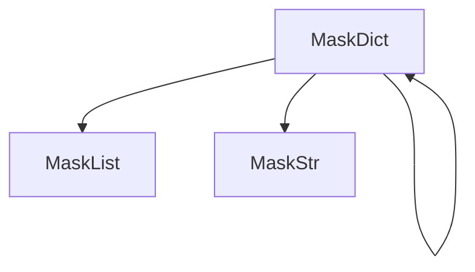
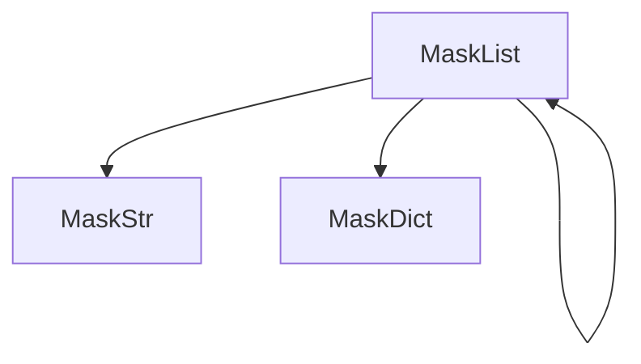

# Advanced Usage

Welcome to the advanced usage guide for `anonymize-data`.

## Installation



## Architecture Overview

!!! note
    Under the hood, the library uses a cascading architecture. Data types are dispatched and masked using the appropriate class.





## Fluent API for Dictionaries

When working with dictionaries, you may not want all fields to be masked. You can use the Fluent API method `.with_keys()` to select precisely which keys should be evaluated.

```python
from anonymizer_data import MaskDict

dict_data = MaskDict({
    "username": "JhonDoe",
    "password": "123Change",
    "roles": ['Admin', 'developer'],
    "contact": {
        "number": "+55 (99) 99999-9999"
    }
}).with_keys(['password', 'number'])

dict_data.anonymize()

print(dict_data)  
# {'username': 'JhonDoe', 'password': '*********', 'roles': ['Admin', 'developer'], 'contact': {'number': '*******************'}}
```

## Unique Data Masking by Keys

The library has a built-in registry of sensitive data types (like CPF, CNPJ, Email, Phone, etc.). By passing `key_with_type_mask=True`, `MaskDict` will automatically apply specific format-preserving masks to known sensitive keys.

```python
from anonymizer_data import MaskDict

dict_data = MaskDict({
    "username": "JhonDoe",
    "password": "123Change",
    "roles": ['Admin', 'developer'],
    "contact": {
        "number": "+55 (99) 99999-9999",
        "email": "jhondoe.09@example.com"
    }
}, key_with_type_mask=True)

dict_data.anonymize()

print(dict_data)  
# {'username': '*******', 'password': '*********', 'roles': ['Admin', 'developer'], 'contact': {'number': '*******************', 'email': '*********9@example.com'}}
```

This unique anonymization is highly robust and applies specialized validation logic before masking.

For example, using the `MaskStr` class explicitly with the "cpf" mask:

```python
from faker import Faker
from anonymizer_data import MaskStr

fake = Faker('pt_BR')
cpf_mask = MaskStr(fake.cpf(), type_mask='cpf').anonymize()

print(cpf_mask)  
# Result: ***.739.***-**
```

Each dictionary key is passed as `type_mask` for the value when masked, so the anonymization happens through `MaskStr` inherently.

```python
from anonymizer_data import MaskStr

string = MaskStr("+55 (11) 91234-5678", type_mask="phone")
string.anonymize()

print(string)  
# Result: +** (**) *****-*678
```

!!! warning
    The `size_anonymization` parameter is only used by the "string" mask type. This parameter has no effect if you pass a specific `type_mask` like "phone" or "cpf".

## Cascading Contexts

The `type_mask` context cascades to inner structures. Example passing a `type_mask` to a `MaskList`:

```python
from anonymizer_data import MaskList

phones = MaskList(["+55 (11) 91234-5678", "123-456-7890", "9876543210"], type_mask="phone")
phones.anonymize()

print(phones)  
# Result: ['+** (**) *****-*678', '***-***-*890', '*******210']
```

## Data Mask Types

The following mask types are supported out-of-the-box:


